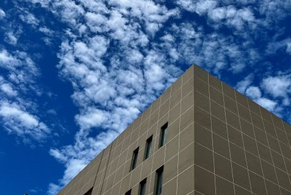

## Yang XU (徐阳)

*Cherish your love and family.*

### Brief bio

I am currently a Ph.D. candidate at Zhejiang University, under the supervision of Prof. [Ronghao Zheng](https://person.zju.edu.cn/ronghaozheng) and Prof. [Meiqin Liu](https://person.zju.edu.cn/mliu). My research interests include SLAM, control and planning in robotics.

---

### News

- 2022.06.30 One paper got accepted by **IROS 2022**.
- 2022.03.14 One co-authored paper was accepted by **Robotics and Autonomous Systems (RAS)**, congrats to **Ruofei** !
- 2022.02.24 One paper got accepted by **IEEE Transactions on Instrumentation and Measurement (TIM)**.
- 2021.09.30 I gave an oral presentation on **IROS 2021**.
- 2021.07.01 One paper got accepted by **IROS 2021**.
- 2021.06.14 One paper got accepted by **IEEE Robotics and Automation Letters (RA-L)** .

---

### Publications

##### Journal papers

- **Yang Xu**, Ronghao Zheng\*, Meiqin Liu et al. **CRMI: Confidence-rich Mutual Information for Information-theoretic Mapping**, *IEEE Robotics and Automation Letters (**RA-L**)*, 6(4): 6434 - 6441, 2021. (presented at **IROS 2021**) [DOI: 10.1109/LRA.2021.3093023](https://ieeexplore.ieee.org/document/9466474).
- **Yang Xu**, Ronghao Zheng\*, Meiqin Liu et al. **Robust inertial-aided underwater localization based on imaging sonar keyframes**, *IEEE Transactions on Instrumentation and Measurement (**TIM**)*, 71(7501812): 1 - 12, 2022. [DOI: 10.1109/TIM.2022.3156980](https://ieeexplore.ieee.org/document/9729232).
- Ruofei Bai, Ronghao Zheng\*, **Yang Xu**, Meiqin Liu et al. **Hierarchical Multi-robot Strategies Synthesis and Optimization under Individual and Collaborative Temporal Logic Specifications**, *Robotics and Autonomous Systems*, 153(104085), 2022. [DOI:10.1016/j.robot.2022.104085](https://doi.org/10.1016/j.robot.2022.104085). 
- **Yang Xu**, Ronghao Zheng*, Meiqin Liu et al.  CLAM: Confidence-rich Localization and Mapping based on Particle Filter for Robotic Exploration, submitted to *IEEE/ASME Transactions on Mechatronics* (**T-Mech**), 2022. 

##### Conference papers

- **Yang Xu**, Ronghao Zheng\*, Meiqin Liu et al. **Confidence-rich Localization and Mapping based on Particle Filter for Robotic Exploration**, *IROS 2022*, accepted. [[Preprint on arxiv](https://arxiv.org/abs/2202.09631)]
- **Yang Xu**, Ronghao Zheng\*, Meiqin Liu et al. **Keyframe-based imaging sonar localization and navigation using elastic windowed optimization**, *IEEE/MTS OCEANS*, Singapore – U.S. Gulf Coast, 2020: 1-7. [DOI: 10.1109/IEEECONF38699.2020.9389045](https://ieeexplore.ieee.org/document/9389045).
- **Yang Xu**, Jun Wang, Jinhua Wang et al. **Nonlinear Formation Control of Small Fixed-Wing UAVs with Velocity and Heading Rate Constraints**, *2018 IEEE International Conference on Mechatronics and Automation (ICMA)*. 2018:1275-1280.

---

### Projects

- **Learning-based informative path planning** (Dec. 2021 - Now)

Utilize information theory and machine learning techniques to guide the robots to explore unknown and unstructured environments autonomously under the constraints of the real world. Our work mainly focuses on introducing more advanced learning techniques to handle the challenge of exploration and exploitation in robotic active sensing, as well as computational efficiency. (*Prepared for IEEE ICRA 2023*)

- **Information-based robot exploration with pose uncertainty** (Jul. 2021 - Nov. 2021)

Previous works concerned more about active mapping/exploration with known poses or utilize inaccurate information metrics, resulting in imbalanced exploration. We propose a Rao-Blackwellized particle filter-based confidence-rich localization and mapping (RBPF-CRLM) scheme with a new closed-form weighting method. We further compute the uncertain CRMI (UCRMI) with the weighted particles by a more accurate approximation. The localization accuracy and exploration performance of the proposed methods are shown in the unstructured environments. (*Accepted by IEEE IROS 2022 and submitted to T-Mech*)

- **Information-theoretic mapping for range sensing robots** (Sept. 2020 - June 2021)

Traditional works based on hand-engineered inverse sensor model (ISM) mapping or kernel inference methods lead to imbalanced accuracy and efficiency. We propose a new approach to compute mutual information more accurately, based on the continuous belief distribution over the occupancy map and called confidence-rich mutual information (CRMI). Extensive simulations and experiments show the desired exploratory behavior to unexplored and obscured regions for CRMI-based robot controllers in the unstructured and cluttered scene, even in large scale environment. (*Accepted by both IEEE RA-L and IEEE IROS 2021*)

- **Imaging sonar-based underwater SLAM** (Jul. 2019 - Aug. 2020)

The sparsity of underwater acoustic features and the loss of elevation angle in sonar images impose degeneracy cases in feature-based SLAM. We proposes a robust imaging sonar SLAM approach based on sonar keyframes (SKFs) and an elastic sliding window optimization framework to handle these degeneracy cases. (*Accepted by IEEE/MTS OCEANS 2020 and IEEE Trans. on Instrumentation & Measurement 2022*)

- **ROS simulator for underwater robotics** (Jul. 2019 - Apr. 2020)

  A simulator for underwater vehicles mounted with different sensors, such as sonar, camera and IMU.

---

### Academic Services

- IEEE Student Member
- Review for IROS, IEEE/CAA Journal of Automatica Sinica (JAS)

---

### Useful links

- [Google scholar](https://scholar.google.com/citations?user=0jlkaLsAAAAJ&hl=zh-CN)

- [Researchgate](https://www.researchgate.net/profile/Yang-Xu-135)

---

### Contact me

- xuyang94@zju.edu.cn (academic)
